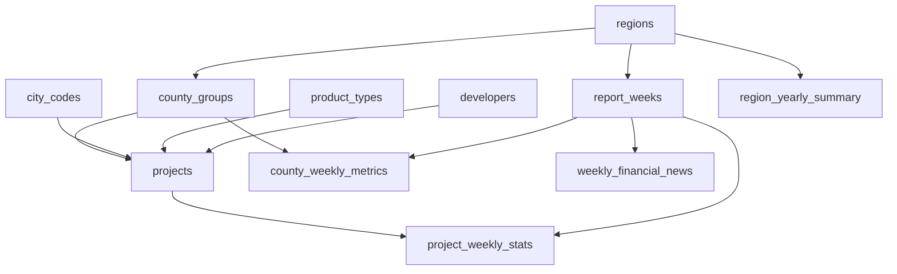

# Ryness Weekly Sales Database Model

This document describes the relational data model that powers the Ryness weekly sales reports. The goal of the schema is to capture **who** is selling (projects, developers, regions), **what** they are selling (product types, city codes), and **how performance evolves each week** (traffic, releases, contracts, cancellations and velocity metrics).

## Design Overview

The schema follows a star/constellation layout:

- **Dimension tables** hold slowly changing reference data (`regions`, `county_groups`, `city_codes`, `product_types`, `developers`, `projects`).
- **Fact tables** record metrics at different grains (`project_weekly_stats`, `county_weekly_metrics`, `region_yearly_summary`).
- **Auxiliary tables** capture narrative context (`weekly_financial_news`) and support future extensibility (for example, KPI snapshots or comparative analytics).

The figure below summarises the relationships:



## Table Catalogue

### `regions`

Represents the high-level market section of the report (e.g. **Bay Area**, **Sacramento**). Each region has a natural-language `name` and a slug suitable for URLs (`bay-area`, `sacramento`).

### `county_groups`

Groups projects inside a region the same way the report renders county pages (e.g. *Placer / Nevada | Placer County*). A `display_order` column helps preserve the original ordering.

### `city_codes`

Maps the short city abbreviations that appear inside the PDF (e.g. `RV` → *Roseville*). City codes can optionally be shared across regions; if they are region-specific the foreign keys keep everything aligned.

### `product_types`

Standardises the marketing product codes from the footer legend (e.g. `DTMU`, `ATMU`, `AASF`). The `category` column captures broader groupings such as *Active Adult* or *Attached*.

### `developers`

Normalised list of builders appearing in the reports. We keep a unique constraint on the name so that typos surface quickly.

### `projects`

The canonical catalogue of developments tracked by Ryness. Projects reference a `developer`, live inside a `county_group`, optionally carry a `city_code`, and are tagged with a `product_type_code`. The `first_report_week_id` / `last_report_week_id` fields make it trivial to compute active spans and filter stale projects from operational dashboards.

### `report_weeks`

Captures each weekly snapshot per region. Important attributes include:

- `week_end_date`: the Sunday referenced in the PDF header.
- Generated columns `week_of_year`, `calendar_year`, and `week_start_date` (six days prior).
- Optional metadata such as `week_label` (e.g. *Week 48 – Thanksgiving push*) and `source_pdf` for traceability.

The `(region_id, week_end_date)` unique key guarantees a single snapshot per market per Sunday.

### `project_weekly_stats`

Fact table at the **project × week** grain. Metrics correspond closely to the per-project table in the PDF:

| Column | Meaning |
| --- | --- |
| `units_total` | Total homes (plan inventory) in the community |
| `units_new_released` | Homes newly released that week |
| `units_released_to_date` | Cumulative released inventory |
| `units_remaining` | Unreleased inventory |
| `traffic` | Weekly qualified traffic count |
| `sales_this_week` | Net contracts written (before cancellations) |
| `cancellations_this_week` | Rescinded contracts during the week |
| `sold_to_date` | Cumulative net sales since open |
| `sold_year_to_date` | Net sales during the calendar year |
| `average_sales_per_week` | Rolling weekly absorption |
| `average_sales_per_week_ytd` | Year-to-date average absorption |

The computed field `net_sales_this_week` simplifies ratio calculations (traffic-to-sales, etc.).

### `county_weekly_metrics`

Stores the aggregate lines found under each county table (e.g. *TOTALS: No. Reporting: …*). These metrics can be derived from the project fact table, but persisting them lets you capture the exact numbers shown in the report or import alternate methodologies delivered by the business analysts.

### `region_yearly_summary`

Captures the yearly averages table on page one (projects, traffic, sales, cancels, average project sales). Values are already averaged so we use `NUMERIC(8,2)` to preserve precision.

### `weekly_financial_news`

Holds the week’s financing commentary and rate snapshot so that downstream apps (dashboards, newsletter automation) can surface the narrative alongside the numbers.

## Loading Workflow

1. **Seed reference data** using `db/seeds/reference_data.sql`. This script populates the region list, product type legend, initial county groups, and known city codes.
2. **Load weekly snapshots** by inserting into `report_weeks`, creating/refreshing `developers` and `projects`, then writing `project_weekly_stats` rows.
3. Optionally load `county_weekly_metrics`, `region_yearly_summary`, and `weekly_financial_news` entries when the corresponding data is available.

## Example Queries

Average absorption for Sacramento projects during November 2025:

```sql
SELECT p.name,
       cg.display_name AS county,
       stats.average_sales_per_week,
       stats.average_sales_per_week_ytd
FROM project_weekly_stats stats
JOIN projects p ON p.project_id = stats.project_id
JOIN report_weeks rw ON rw.report_week_id = stats.report_week_id
JOIN county_groups cg ON cg.county_group_id = p.county_group_id
JOIN regions r ON r.region_id = rw.region_id
WHERE r.slug = 'sacramento'
  AND stats.sales_this_week IS NOT NULL
  AND rw.week_end_date BETWEEN DATE '2025-11-01' AND DATE '2025-11-30'
ORDER BY stats.average_sales_per_week DESC;
```

Traffic-to-sales conversion rate per county (derivable from the fact table):

```sql
SELECT cg.display_name,
       SUM(stats.traffic) AS traffic,
       SUM(stats.sales_this_week) AS sales,
       CASE WHEN SUM(stats.sales_this_week) = 0
            THEN NULL
            ELSE ROUND(SUM(stats.traffic)::NUMERIC / SUM(stats.sales_this_week), 2)
       END AS traffic_to_sales_ratio
FROM project_weekly_stats stats
JOIN projects p ON p.project_id = stats.project_id
JOIN county_groups cg ON cg.county_group_id = p.county_group_id
JOIN report_weeks rw ON rw.report_week_id = stats.report_week_id
WHERE rw.week_end_date = DATE '2025-11-30'
GROUP BY cg.display_name
ORDER BY cg.display_name;
```

## Next Steps

- Extend the seed script with additional county groups as new PDFs arrive.
- Automate PDF ingestion via the Python parser outlined in `src/ryness/parser.py` (see project README for usage).
- Layer in dbt or a BI semantic model once transaction-level loading is automated.
